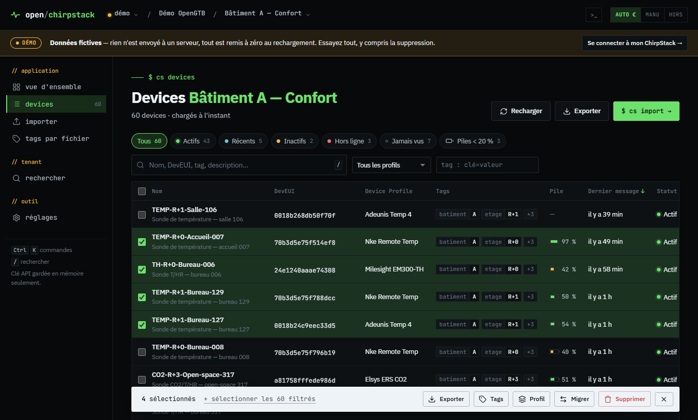

# open/chirpstack

*[English version](README.md)*

**Vos devices ChirpStack v4, en masse.** Importer, exporter, migrer, retagger et surveiller des centaines de devices LoRaWAN en quelques clics.
Un seul fichier à télécharger : double-clic, le navigateur s'ouvre, vous collez votre clé API.

Pas de serveur à installer, pas de Docker, pas de compte. L'outil tourne sur votre poste et parle directement à votre ChirpStack.
Interface en français et en anglais (bascule en un clic).

**[Essayer la démo en ligne](https://opengtb.github.io/open-chirpstack/)** avec un parc fictif de 247 devices, sans rien installer.



## Ce que ça fait

| | |
|---|---|
| **Vue d'ensemble** | Santé de l'application (actifs, silencieux, jamais vus, piles faibles), santé de chaque application du tenant, gateways hors ligne |
| **Devices** | Liste filtrable (statut, profil, tag, recherche), tri, sélection par plage (Maj + clic), fiche détaillée avec clés, mesures et liaison radio |
| **Actions groupées** | Export CSV / Excel, ajout ou retrait de tags, changement de Device Profile, migration vers une autre application, suppression avec sauvegarde |
| **Import** | Fichier CSV (tout séparateur, UTF-8 ou Windows-1252) ou Excel, copier-coller depuis un tableur, saisie directe. Colonnes reconnues automatiquement, profil indiqué par son nom, vérification complète avant envoi, doublons mis à jour sans suppression, annulation de l'import |
| **Historique** | Mesures enregistrées par ChirpStack (température, humidité, CO2, consigne, compteurs…) et liaison radio : plusieurs mesures et plusieurs devices sur un même graphique, un axe par unité, valeurs au survol, zoom, statistiques, export CSV et PNG |
| **Tags par fichier** | Aperçu exact des changements (avant → après), fusion ou remplacement |
| **Recherche** | Un DevEUI complet ou partiel, un nom, une valeur de tag, dans tout le tenant |
| **Profils d'import** | Tags obligatoires à chaque import (bâtiment, étage, lot…) |
| **Palette de commandes** | `Ctrl+K` : aller à un écran, changer d'application, chercher un DevEUI |

Pensé pour ne rien perdre :

- la migration copie d'abord chaque device (fiche, tags, clés, session) et le **remet dans son application d'origine** si la recréation échoue ;
- l'import ne supprime jamais un device existant : il le met à jour ;
- toute suppression peut être précédée d'une **sauvegarde JSON**, réimportable en un glisser-déposer ;
- les cellules Excel au format nombre, qui altèrent les DevEUI, sont détectées et signalées.

## Démarrage en 1 minute

1. Téléchargez le fichier de votre système dans [Releases](../../releases/latest) :

   | Système | Fichier |
   |---|---|
   | Windows | `open-chirpstack-windows-amd64.exe` |
   | macOS (Apple Silicon M1/M2/M3…) | `open-chirpstack-macos-arm64` |
   | macOS (Intel) | `open-chirpstack-macos-amd64` |
   | Linux | `open-chirpstack-linux-amd64` (ou `-arm64`, par exemple pour un Raspberry Pi) |

2. Lancez-le. Votre navigateur s'ouvre tout seul sur l'outil.
3. Entrez **l'adresse de votre ChirpStack** (celle de son interface web, par exemple `http://192.168.1.10:8080`) et **votre clé API**.

> **Où créer une clé API ?** Dans ChirpStack, menu **API Keys** (clé admin, accès à tous les tenants),
> ou dans un tenant, menu **API Keys** (clé limitée à ce tenant). Avec une clé tenant, collez simplement
> l'adresse d'une page ChirpStack de ce tenant : l'identifiant en est extrait.

Pas de ChirpStack sous la main ? Cliquez sur **« essayer avec des données fictives »** : un parc de démonstration de 247 devices, entièrement en mémoire.

Gardez la fenêtre noire (terminal) ouverte pendant l'utilisation ; fermez-la pour arrêter l'outil. Relancer le fichier alors qu'il tourne déjà rouvre simplement l'onglet.

### Premier lancement : avertissements du système

Le fichier n'est pas signé numériquement (une signature coûte plusieurs centaines d'euros par an). Votre système vous prévient donc une première fois :

- **Windows** : « Windows a protégé votre ordinateur » → *Informations complémentaires* → *Exécuter quand même*.
- **macOS** : clic droit sur le fichier → *Ouvrir* → *Ouvrir*. Si macOS refuse toujours, dans un terminal :
  `xattr -d com.apple.quarantine open-chirpstack-macos-*` puis `chmod +x open-chirpstack-macos-*`.
- **Linux** : `chmod +x open-chirpstack-linux-*` puis `./open-chirpstack-linux-amd64`.

Le code source est entièrement ici : vous pouvez le relire ou compiler l'outil vous-même (voir plus bas). Chaque version publie aussi les empreintes `SHA256SUMS.txt`.

## Sécurité et confidentialité

- **Votre clé API reste sur votre poste.** Elle est gardée en mémoire le temps de la session, jamais enregistrée, et n'est envoyée qu'à votre serveur ChirpStack.
- **Aucune donnée n'est envoyée ailleurs** : pas de statistiques, pas de télémétrie, aucune ressource chargée depuis internet. L'outil fonctionne hors ligne.
- **Le relais local n'écoute que sur votre machine** (`127.0.0.1`), refuse les requêtes venant d'autres sites web et applique une politique de sécurité stricte (aucun script externe ou injecté ne peut s'exécuter).
- **Serveurs enregistrés et profils d'import** sont gardés dans votre navigateur ; exportez-les en JSON depuis *Réglages* pour les partager (les clés API n'en font jamais partie).

> Les opérations en masse modifient votre ChirpStack. Faites un premier essai sur une application de test.

## Compatibilité

- ChirpStack **v4**.
- Fonctionne avec l'adresse de l'interface web de ChirpStack, en HTTP ou HTTPS, y compris derrière un reverse proxy (nginx, traefik…).
- Certificat auto-signé : *options avancées → Accepter un certificat HTTPS auto-signé*.
- Si vous utilisez le composant `chirpstack-rest-api` (port 8090) : *options avancées → Type d'accès → API REST*.

## Options de lancement

```
open-chirpstack --port 9000      # changer le port local (8765 par défaut)
open-chirpstack --no-browser     # ne pas ouvrir le navigateur automatiquement
open-chirpstack --version
```

## Démo en ligne

Le dossier `web/` fonctionne aussi seul, hébergé comme un simple site statique : il propose alors uniquement la démo et un lien de téléchargement.
Le workflow `pages.yml` le publie sur GitHub Pages à chaque mise à jour de `main` (à activer une fois : *Settings → Pages → Source : GitHub Actions*).

## Comment ça marche

Un navigateur ne peut pas appeler directement l'API de ChirpStack depuis une autre page (règle CORS). L'exécutable sert donc deux choses, sur votre machine uniquement :

1. **l'interface web** (embarquée dans l'exécutable) ;
2. **un petit relais** qui traduit les appels de l'interface en appels **gRPC-web** vers ChirpStack, le protocole de l'interface officielle de ChirpStack : partout où l'interface ChirpStack s'ouvre, l'outil fonctionne.

```
Navigateur ──HTTP local──▶ open-chirpstack (127.0.0.1) ──gRPC-web──▶ votre ChirpStack
```

## Compiler soi-même

Il faut [Go](https://go.dev/dl/) (version indiquée dans `go.mod`).

```bash
go test ./...
go build -trimpath -ldflags "-s -w" -o open-chirpstack .
```

Pour une autre plateforme : `GOOS=windows GOARCH=amd64 go build ...`

Pendant le développement de l'interface, `--web-dir web` sert les fichiers depuis le disque (pas besoin de recompiler).

Pour publier une version : poussez un tag `vX.Y.Z`. GitHub Actions compile les exécutables et crée la release.

### Organisation du code

```
main.go               lancement, ouverture du navigateur
server.go             serveur local : interface + relais /api/*
internal/grpcweb/     client gRPC-web minimal
internal/csapi/       définitions de l'API ChirpStack (reprises de chirpstack-rest-api)
web/index.html        page d'entrée
web/assets/           styles, polices (IBM Plex Sans, JetBrains Mono)
web/js/               interface (modules JavaScript, sans build)
web/js/views/         un fichier par écran
web/js/i18n.js        traduction (le texte français sert de clé, l'anglais est dans web/js/locales/)
web/js/demo.js        faux ChirpStack en mémoire pour la démo
web/vendor/           SheetJS (Excel), chargé seulement quand il sert
```

## Licence

MIT, voir [LICENSE](LICENSE). Composants tiers : voir [THIRD_PARTY_NOTICES.md](THIRD_PARTY_NOTICES.md).

Un outil de la boîte à outils [OpenGTB](https://opengtb.com). Projet indépendant, non affilié à ChirpStack ni à ses auteurs.
