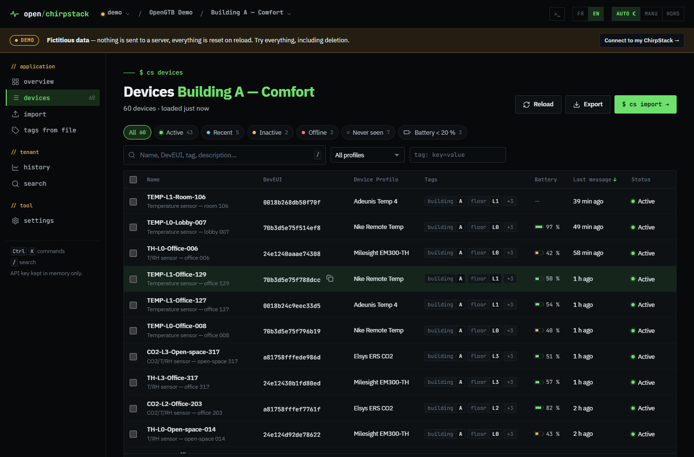

# open/chirpstack

*[Version française](README.fr.md)*

**Your ChirpStack v4 devices, in bulk.** Import, export, migrate, retag and monitor hundreds of LoRaWAN devices in a few clicks.
One file to download: double-click it, your browser opens, paste your API key.

No server to install, no Docker, no account. The tool runs on your computer and talks directly to your ChirpStack.
The interface is available in English and French (one click to switch).

**[Try the online demo](https://opengtb.github.io/open-chirpstack/)** with a fictitious fleet of 247 devices, nothing to install.



## Features

| | |
|---|---|
| **Overview** | Application health (active, silent, never seen, low batteries), health of every application in the tenant, offline gateways |
| **Devices** | Filterable list (status, profile, tag, search), sorting, range selection (Shift + click), detail panel with keys, measurements and radio link |
| **Bulk actions** | CSV / Excel export, add or remove tags, change Device Profile, migrate to another application, delete with backup |
| **Import** | CSV file (any separator, UTF-8 or Windows-1252) or Excel, copy-paste from a spreadsheet, direct entry. Columns detected automatically, profile given by name, full validation before sending, existing devices updated instead of deleted, one-click undo |
| **History** | Measurements stored by ChirpStack (temperature, humidity, CO2, setpoint, counters…) and radio link: several measurements and several devices on one chart, one axis per unit, values on hover, zoom, statistics, CSV and PNG export |
| **Tags from a file** | Exact preview of the changes (before → after), merge or replace |
| **Search** | A full or partial DevEUI, a name, a tag value, across the whole tenant |
| **Import profiles** | Tags required on every import (building, floor, lot…) |
| **Command palette** | `Ctrl+K`: go to a screen, switch application, look up a DevEUI |

Built so that nothing gets lost:

- migration first copies each device (record, tags, keys, session) and **puts it back in its original application** if re-creation fails;
- import never deletes an existing device: it updates it;
- any deletion can be preceded by a **JSON backup**, re-importable with a drag and drop;
- Excel cells formatted as numbers, which corrupt DevEUIs, are detected and reported.

## Getting started in 1 minute

1. Download the file for your system from [Releases](../../releases/latest):

   | System | File |
   |---|---|
   | Windows | `open-chirpstack-windows-amd64.exe` |
   | macOS (Apple Silicon M1/M2/M3…) | `open-chirpstack-macos-arm64` |
   | macOS (Intel) | `open-chirpstack-macos-amd64` |
   | Linux | `open-chirpstack-linux-amd64` (or `-arm64`, e.g. for a Raspberry Pi) |

2. Run it. Your browser opens on the tool.
3. Enter **your ChirpStack address** (the one of its web interface, e.g. `http://192.168.1.10:8080`) and **your API key**.

> **Where do I create an API key?** In ChirpStack, **API Keys** menu (admin key, access to all tenants),
> or inside a tenant, **API Keys** menu (key limited to that tenant). With a tenant key, simply paste
> the address of any ChirpStack page of that tenant: its ID is extracted automatically.

No ChirpStack at hand? Click **"try with fictitious data"**: a demo fleet of 247 devices, entirely in memory.

Keep the black (terminal) window open while you use the tool; close it to stop the tool. Launching the file again while it is running simply reopens the tab.

### First launch: system warnings

The file is not digitally signed (a signing certificate costs several hundred euros a year), so your system warns you the first time:

- **Windows**: "Windows protected your PC" → *More info* → *Run anyway*.
- **macOS**: right-click the file → *Open* → *Open*. If macOS still refuses, in a terminal:
  `xattr -d com.apple.quarantine open-chirpstack-macos-*` then `chmod +x open-chirpstack-macos-*`.
- **Linux**: `chmod +x open-chirpstack-linux-*` then `./open-chirpstack-linux-amd64`.

All the source code is here: you can review it or build the tool yourself (see below). Each release also publishes `SHA256SUMS.txt` checksums.

## Security and privacy

- **Your API key stays on your computer.** It is kept in memory for the session only, never saved, and only sent to your ChirpStack server.
- **No data is sent anywhere else**: no analytics, no telemetry, no resource loaded from the internet. The tool works offline.
- **The local relay only listens on your machine** (`127.0.0.1`), rejects requests coming from other websites and enforces a strict security policy (no external or injected script can run).
- **Saved servers and import profiles** are kept in your browser; export them as JSON from *Settings* to share them (API keys are never included).

> Bulk operations modify your ChirpStack. Try them on a test application first.

## Compatibility

- ChirpStack **v4**.
- Works with the address of the ChirpStack web interface, over HTTP or HTTPS, including behind a reverse proxy (nginx, traefik…).
- Self-signed certificate: *advanced options → Accept a self-signed HTTPS certificate*.
- If you use the `chirpstack-rest-api` component (port 8090): *advanced options → Access type → REST API*.

## Command-line options

```
open-chirpstack --port 9000      # change the local port (8765 by default)
open-chirpstack --no-browser     # do not open the browser automatically
open-chirpstack --version
```

## Online demo

The `web/` folder also works on its own, hosted as a plain static site: it then only offers the demo and a download link.
The `pages.yml` workflow publishes it to GitHub Pages on every update of `main` (enable once: *Settings → Pages → Source: GitHub Actions*).

## How it works

A browser cannot call the ChirpStack API directly from another page (CORS rule). The executable therefore serves two things, on your machine only:

1. **the web interface** (embedded in the executable);
2. **a small relay** that translates the interface calls into **gRPC-web** calls to ChirpStack, the protocol used by ChirpStack's own web interface: wherever the ChirpStack interface opens, the tool works.

```
Browser ──local HTTP──▶ open-chirpstack (127.0.0.1) ──gRPC-web──▶ your ChirpStack
```

## Building it yourself

You need [Go](https://go.dev/dl/) (version given in `go.mod`).

```bash
go test ./...
go build -trimpath -ldflags "-s -w" -o open-chirpstack .
```

For another platform: `GOOS=windows GOARCH=amd64 go build ...`

While working on the interface, `--web-dir web` serves the files from disk (no rebuild needed).

To publish a release: push a `vX.Y.Z` tag. GitHub Actions builds the executables and creates the release.

### Code layout

```
main.go               startup, browser opening
server.go             local server: interface + /api/* relay
internal/grpcweb/     minimal gRPC-web client
internal/csapi/       ChirpStack API definitions (taken from chirpstack-rest-api)
web/index.html        entry page
web/assets/           styles, fonts (IBM Plex Sans, JetBrains Mono)
web/js/               interface (JavaScript modules, no build step)
web/js/views/         one file per screen
web/js/i18n.js        translation (French text is the key, English in web/js/locales/)
web/js/demo.js        in-memory fake ChirpStack for the demo
web/vendor/           SheetJS (Excel), loaded only when needed
```

## License

MIT, see [LICENSE](LICENSE). Third-party components: see [THIRD_PARTY_NOTICES.md](THIRD_PARTY_NOTICES.md).

Part of the [OpenGTB](https://opengtb.com) toolbox. Independent project, not affiliated with ChirpStack or its authors.
